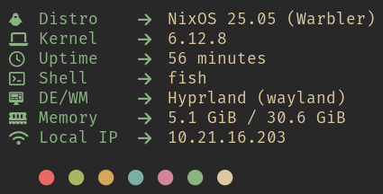

# 🐹 gotcha, my small fetch tool




gotcha is a small fetcher written in go. It has absolutely no customization (at
least for now) and is primarily intended for my system.

## ✨ features

- speedy boi (on my machine [<2ms](#%EF%B8%8F-benchmarks))
- no dependencies besides linux and the binary itself (and go for building duh)
- can update itself with `gotcha update`
- displays:
  - distribution
  - kernel version
  - uptime (in days too 😈)
  - shell
  - desktop environment/window manager
  - memory usage
  - ip (of an automagically[^1] selected interface)

[^1]:
    automagically in the sense of that it _should_ select the appropriate
    interface

## 🛠️ benchmarks

With my `AMD Ryzen 9 6900HX` CPU I get the following results from some fetches I
know (and mine ofc):

| Command     |    Mean [ms] | Min [ms] | Max [ms] |       Relative |
| :---------- | -----------: | -------: | -------: | -------------: |
| `gotcha`    |    1.6 ± 0.2 |      1.2 |      2.0 |           1.00 |
| `macchina`  |   13.1 ± 0.7 |     11.5 |     17.7 |    8.09 ± 0.94 |
| `neofetch`  | 584.4 ± 10.5 |    573.5 |    606.5 | 360.93 ± 37.50 |
| `fastfetch` |   93.7 ± 1.3 |     91.4 |     96.1 |   57.90 ± 5.98 |
| `pfetch`    |  146.2 ± 2.8 |    142.4 |    153.8 |   90.29 ± 9.40 |

<sub>created with [hyperfine](https://github.com/sharkdp/hyperfine)</sub>

## 📦 installation

### ❄️ nix (with flakes)

Add this thingy to your inputs:

```nix
inputs = {
  # ...
  gotcha = {
    url = "github:MrSom3body/gotcha";
    # only add the inputs part if you don't want to use the cache
    inputs = {
      nixpkgs.follows = "nixpkgs";
    };
  };
  # ...
};
```

Andddd add this the package to home-manager or your system wide nix config:

```nix
inputs.gotcha.packages.${pkgs.stdenv.hostPlatform.system}.default
```

#### 🍱 Cache

If you want to use the cache you can do so by adding the following lines to your
nix config:

```nix
{
  nix.settings = {
    substituters = [
      "https://gotcha.cachix.org"
    ];
    trusted-public-keys = [
      "gotcha.cachix.org-1:HvkCMDHVThJj/aaxBgDvjraKYSNM1yFKveTsPYG3YUA="
    ];
  };
}

```

### 🐧 all other distributions

Get the [latest release](https://github.com/MrSom3body/gotcha/releases) or just
compile it yourself. Compiling it is extremely easy if you have `just` installed
(or else copy the command with `go build` in it from the `justfile`):

```bash
just build
```

After installing it you can update it by simply using `gotcha update`.

### 🧰 overrides

There is no real configuration, but you can override some values to change some
things. The process of this is imo easier for nix but if you compile it yourself
because you use a ~inferior~ different distro you need to do so with some flags.

| Key   | Default Value | Description                                                           |
| ----- | ------------- | --------------------------------------------------------------------- |
| color | `6`           | The integer value of the color (0-7[^2]) you want to use for the keys |

[^2]:
    Use one of these commands to display the 8 colors:
    bash: `for i in $(seq 0 7); do tput setaf $i && echo $i; done`
    fish: `for i in (seq 0 7); tput setaf $i && echo $i; end`

#### ❄️ nix overrides

If you want to change the interface name for the IP you can override the package
like this:

```nix
(inputs.gotcha.packages.${pkgs.stdenv.hostPlatform.system}.default.override {
  <key> = "<value>";
})
```

#### 🔨 compiling

For every override you want to add you must add this
`-X 'github.com/MrSom3body/gotcha/cmd.<key>=<value>'` to the `-ldflags` like so:

```bash
go build -ldflags="-s -w -X 'github.com/MrSom3body/gotcha/cmd.<key>=<value>'"
```

## 🤔 why this name?

go + fetch → gofetch → gotch → gotcha

I know gotcha makes absolutely no sense for a fetcher but idc :)

## 🫂 credits

- [NotAShelf/microfetch](https://github.com/NotAShelf/microfetch) for inspiring
  me to write my own fetch
- [Macchina-CLI/macchina](https://github.com/Macchina-CLI/macchina) for
  providing an idea on how I'd like it to look

## ⭐ stargraph

<picture>
  <source media="(prefers-color-scheme: dark)"
    srcset="https://api.star-history.com/svg?repos=MrSom3body/gotcha&type=Date&theme=dark"/>
  <source media="(prefers-color-scheme: light)"
    srcset="https://api.star-history.com/svg?repos=MrSom3body/gotcha&type=Date"/>
  
</picture>
